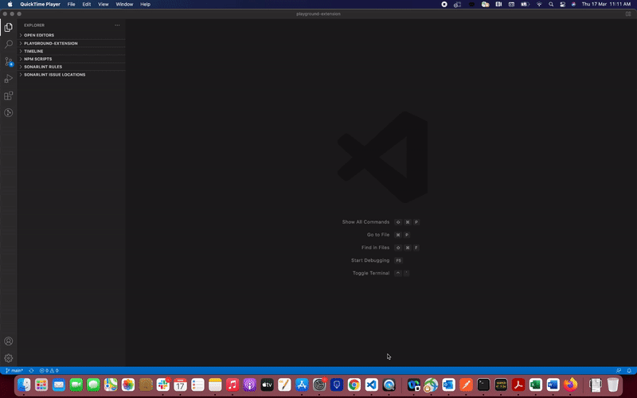

# Connect to Cloudant DB from within Visual Studio Code

How to Install the extension



Features

1. Create a document
2. View all documents in the DB
2. View details of a document
4. Delete a document

Building and Installing from Source

You can clone this repository and run the below commnands:

```
npm install
npm run compile
```

To run the extension, choose the menu Run > Run without Debugging and this will launch a separate VS Code instance. Click on the Cloudant Explorer icon, provide the connection details and you are all set to explore your Cloudant DB.

1. Connect to Cloudant DB using URL and API key from your service credential.
2. View all documents in the DB in the left pane Cloudant Explorer: Cloudant Docs.
3. To view the details of the document, click on the document and the details will be displayed in the right pane.
4. To create a document, hover on the database and click on the + icon to create a new document. Fill the details in the right pane and save.
5. To delete the document, click on the document and click on the delete icon. 

Note: In order to use IBM Cloudant service, refer https://cloud.ibm.com/docs/Cloudant?topic=Cloudant-getting-started-with-cloudant.

